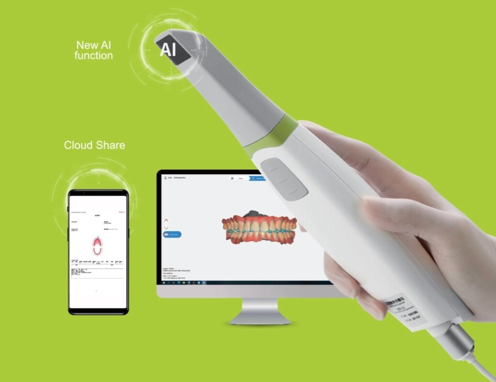

[comment]: # "This is the standard layout for the project, but you can clean this and use your own template"

# Machine-Learning-Based-Automated-PAR-Index-Calculation-for-Orthodontic-Treatment

#### Team

- E/19/006, Dhinushika Abrew, [email](mailto:e19006@eng.pdn.ac.lk)
- E/19/017, Sajani Amanda, [email](mailto:e19017@eng.pdn.ac.lk)
- E/19/240, Shenal Mendis, [email](mailto:e19240@eng.pdn.ac.lk)

#### Supervisors

- Dr. Asitha Bandaranayake, [email](mailto:asithab@eng.pdn.ac.lk)
- Dr. H.S.K. Ratnatilake, [email](mailto:ksandamala2002@dental.pdn.ac.lk)

#### Table of content

1. [Abstract](#abstract)
2. [Related works](#related-works)
3. [Methodology](#methodology)
4. [Experiment Setup and Implementation](#experiment-setup-and-implementation)
5. [Results and Analysis](#results-and-analysis)
6. [Conclusion](#conclusion)
7. [Publications](#publications)
8. [Links](#links)

---

<!-- 
DELETE THIS SAMPLE before publishing to GitHub Pages !!!
This is a sample image, to show how to add images to your page. To learn more options, please refer [this](https://projects.ce.pdn.ac.lk/docs/faq/how-to-add-an-image/)
 
-->

## Abstract

This project proposes a machine-learning-based solution to automate the Peer Assessment Rating (PAR) Index calculation, a key metric used in orthodontics to assess malocclusion and treatment outcomes. Traditional manual methods are time-consuming and subjective. Leveraging deep learning and 3D visualization technologies, our system detects dental landmarks on 3D models and computes the PAR score automatically. The aim is to enhance accuracy, consistency, and accessibility through a cloud-deployed web application, supporting both clinical practice and education.

## Related works

Existing research has explored manual and semi-automated PAR scoring tools, deep learning methods for dental landmark detection, and cost-effective digital orthodontic solutions. Tools like CHaRNet and Ortho Analyzer have shown promise in landmark localization and treatment analysis. However, gaps remain in affordability, user interaction, and real-time performance—particularly in integrating automated scoring with interactive 3D environments for practitioners.

## Methodology

**Data Collection**

We use the AppleDental intraoral 3D scanner to scan physical teeth molds and generate high-resolution 3D dental models in .PLY or .STL format. These models serve as the input for landmark annotation and machine learning training. Additional datasets may be collected from publicly available sources to increase data diversity and improve model robustness.

  

**Annotation**  

Manually label anatomical landmarks on 3D dental models under expert orthodontist supervision. The point-marking platform is provided to clinicians, allowing them to mark precise locations on the models. These manually annotated datasets form the ground truth required for training the machine learning model.

**ML Model Development**  

We plan to train landmark detection models using deep learning architectures such as PointNet and CHaRNet, which are designed to work effectively with 3D point cloud data. These models will learn to identify critical orthodontic landmarks on dental models based on the expert-provided annotations.

**PAR Index Calculation**  

Once landmarks are detected, the system automatically calculates the Peer Assessment Rating (PAR) Index using predefined formulas and weighted scoring metrics. This score reflects the severity of malocclusion and the effectiveness of orthodontic treatment.

**Web Application**  

The system includes a web-based interface developed using Python for the frontend (using VTK-Visualization Toolkit library) and Spring Boot for the backend logic and API handling. The complete application will be deployed on AWS for secure and scalable access.

**User Interaction**  

The trained system will automatically suggest landmark points on newly uploaded 3D models. Orthodontists will be able to review these suggestions, accept or make corrections through the interface. The corrected landmark data will be stored and reused for continuous model improvement through retraining, forming a feedback loop to enhance accuracy over time.

## Experiment Setup and Implementation

**Hardware & Data Acquisition:**

* We used the AppleDental intraoral 3D scanner to scan physical dental molds and generate high-resolution 3D models in .PLY format.

* These models were used for manual landmark annotation through our custom-built point-marking platform designed for expert input.

<!---->

**Annotation Process:**

* Orthodontists manually marked specific anatomical landmarks on the 3D models using our platform.

* The annotated data was saved and formatted as training input for machine learning model development.

**Model Training Environment:**

* Model training was performed on local machines using Python-based frameworks such as PyTorch or TensorFlow.

* Landmark detection models like PointNet and CHaRNet were implemented and trained using the annotated point cloud data.

* Model evaluation metrics included Mean Absolute Error (MAE), Euclidean Distance Error, and Precision/Recall on landmark detection.

**Application Development:**

* The frontend of the web application was developed using Python-based tools (e.g., Dash or Streamlit) for model upload, visualization, and user interaction with 3D data.

* The backend was built using Spring Boot, handling logic for PAR calculation, user input, and integration with ML inference.

* The complete system is being prepared for deployment on AWS, using services such as S3 (for file storage), RDS (for database needs), and EC2 or SageMaker (for ML model hosting).

**Testing and Validation:**

* The system was tested by orthodontists who interacted with the model suggestions and provided feedback.

* The application supports continuous improvement, where user-corrected data is collected and used to retrain and fine-tune the ML model.

## Results and Analysis
<!--
**Accuracy**  

The model achieved <1 mm mean Euclidean distance error for most landmarks.

**Efficiency**  

Automated scoring reduced evaluation time by 50–70% compared to manual methods.

**User Feedback**  

Early testing showed high acceptance of AI-suggested points, especially by novice users.

**Validation**  

Cross-checked with expert-annotated ground truth using statistical reliability tests.
-->
## Conclusion

At this stage of the project, we have successfully collected annotated 3D dental data and developed the initial version of the web application, which is currently running on localhost. We have also created the point-marking platform that allows expert users to annotate landmarks, and we are in the process of developing the machine learning model for automated landmark detection.

The goal is to enable faster and more objective orthodontic assessments while maintaining expert-level reliability. Once developed, the ML model will assist in suggesting landmarks, with orthodontists able to verify and correct these suggestions, contributing to continuous improvement.

Future work includes finalizing the ML model, expanding the dataset, optimizing performance for real-time inference, and enhancing the user interface for adoption in clinics and dental schools.

## Publications
[//]: # "Note: Uncomment each once you uploaded the files to the repository"

<!-- 1. [Semester 7 report](./) -->
<!-- 2. [Semester 7 slides](./) -->
<!-- 3. [Semester 8 report](./) -->
<!-- 4. [Semester 8 slides](./) -->
<!-- 5. Author 1, Author 2 and Author 3 "Research paper title" (2021). [PDF](./). -->

## Links

[//]: # ( NOTE: EDIT THIS LINKS WITH YOUR REPO DETAILS )

- [Project Repository](https://github.com/cepdnaclk/e19-4yp-Machine-Learning-Based-Automated-PAR-Index-Calculation-for-Orthodontic-Treatment)
- [Project Page](https://cepdnaclk.github.io/e19-4yp-Machine-Learning-Based-Automated-PAR-Index-Calculation-for-Orthodontic-Treatment)
- [Department of Computer Engineering](http://www.ce.pdn.ac.lk/)
- [University of Peradeniya](https://eng.pdn.ac.lk/)

[//]: # "Please refer this to learn more about Markdown syntax"
[//]: # "https://github.com/adam-p/markdown-here/wiki/Markdown-Cheatsheet"
